# SWE645 HW3 - EC2 Instance Setup and Kubernetes Cluster Deployment using Rancher with Jenkins CI/CD Pipeline

This repository contains part of the **backend** of the **SWE645 HW3** assignment, which includes YAML files, config files, and images.

YAML Files included for:
- Cluster
- Deployment
- Node Port Service
- KubeConfig

These YAML Files were not modified manually, they were **auto generated** by following the steps below. YAML Files for the 3 Pods are not included because they could change if a Pod goes down. Machines from HW2 were reused.

---

## Prerequisites

Before beginning this part, please complete part 1 from Kris' branch in this repository. Also have with you:

- **Docker Image Tag**: The same image tag you created in part 1.
- **AWS Account**: To create EC 2 instances to run your cluster.

## Setup Instructions
### 1. Clone the repository:
To get started, clone this repository to your local machine:
```
git clone https://github.com/USERNAME/REPOSITORY_NAME.git
cd REPOSITORY_NAME
```

### 2. Log into you AWS Account:
Here you have two choices:

- [Personal AWS Acount login](https://aws.amazon.com/console/)
- [AWS Learner Lab login](https://awsacademy.instructure.com/login/canvas)

If your professor gave you an account for AWS Leaner Lab, you can use that to get some free money to used to create your machines(~$50). Otherwise, you will have to create/use your personal account which will charge you for items used in this part. 

**Note: Items created/used in this part will cost money. This is due to features used/needed for this to work correctly and due to stronger machines needed for Kubernetes Cluster support.**

For this assignment, we will be using AWS Learner Lab.


### 3. Create EC2 Instances:
For this part, we will be using two(2) EC2 instances. One will setup the cluster, while the other will run the actual cluster.

- Log into AWS Learner Lab


- Go to Modules -> Launch AWS Academy Learner Lab

- Click 'Start Lab' and wait a few minutes for it to load. The circle next to AWS will turn green when online. Click that link to go to the AWS Dashboard.

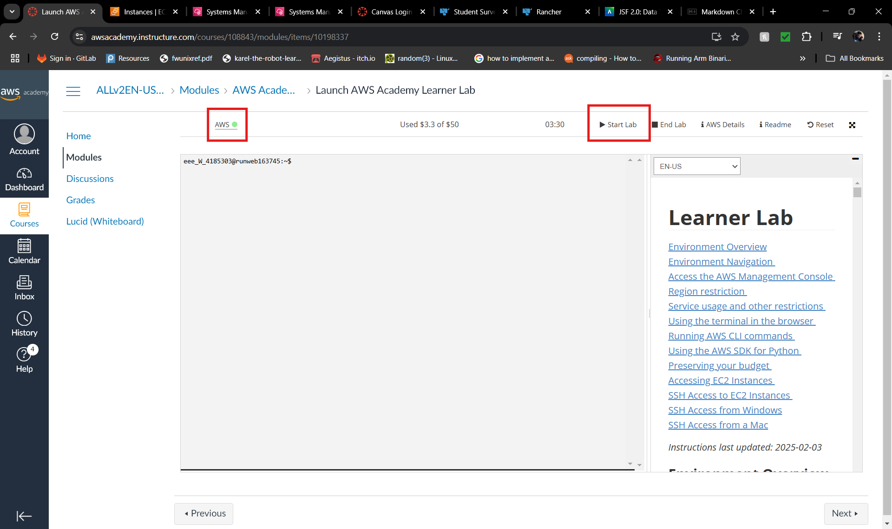


- On the homepage, search for EC2, click the first option


- On the EC2 page, click the orage button labeled 'Launch Instance'

- Here, you set up your two machines, we will create both at the same time. First, fill out a name for both machines. Next, on the right, change the number of instances to 2, that way both machines will have the same settings and key pair. Then, select 'Ubuntu' for OS option, default image is fine.

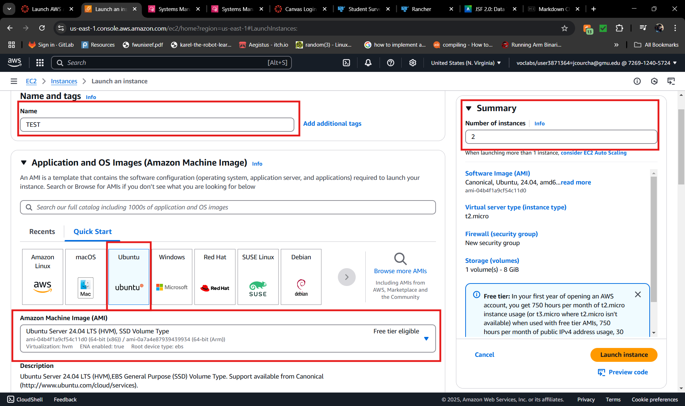

- Scroll down. Leave architecture as is. Change instance type to best that suits you. You will want at least 't2.medium' I recommend 't2.large' for more memory. Then select a key pair. You can create a new one or use an existing one. If creating a new one, click the link, and give it a name in the pop-up box. Leave everything else default. You with then download a private key file. 

- **DO NOT LOSE TRACK OF THIS .pem FILE. This is the only time you will get this file.**

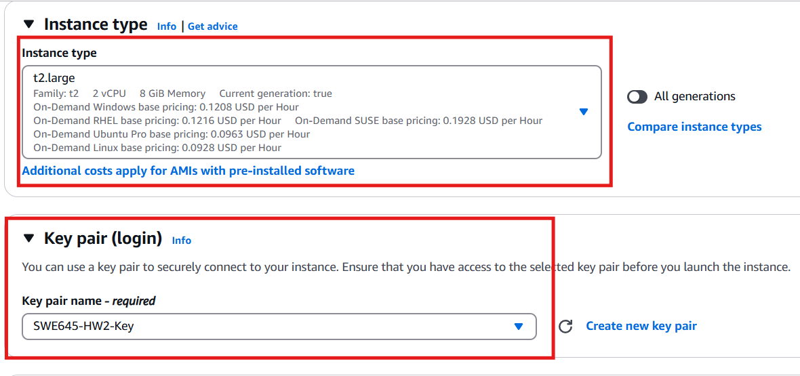

- Next, setup Network Settings. Create a new security group and Allow SSH, HTTPS, and HTTP traffic inbound from anywhere(0.0.0.0/0). You will also need to add one more rule for port 8080. Click edit, scroll to 'Add security group rule.' Copy the settings as below:


- Then, scroll to storage and set it to the size you need. You can get upto 30GB for free. Then, open 'Advanced details', for IAM instance profile, select 'LabInstanceProfile', then click 'Launch Instance' and wait for your machines to be ready.

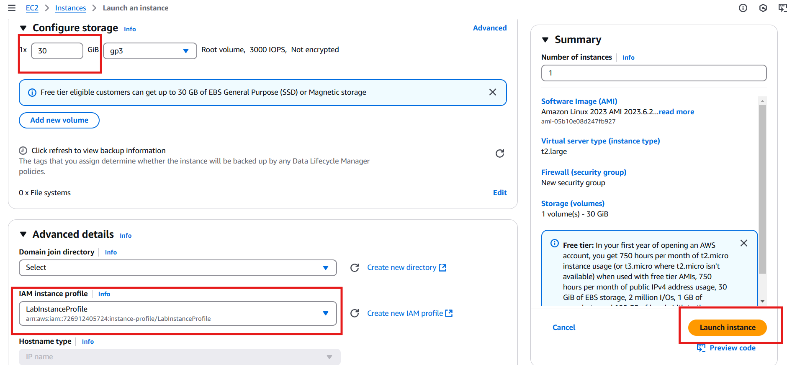


### 4. Setup Rancher on one of the instances
Once your machines are online, we can connect to the both of them. Your machines are ready when the status check shows '2/2 checks passed' on the EC2 Dashboard.

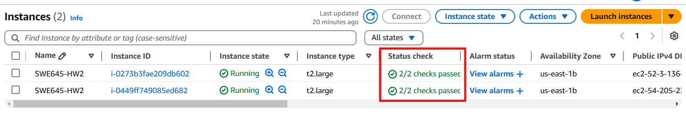

**However, before we can connect to them, we need to setup elastic IP addresses for both machines. This step is crucial to ensure your cluster works again automatically if your machines auto-shutoff or you manually turn them off.**

 - On the EC2 Dashboard, select Elastic IP addresses:

 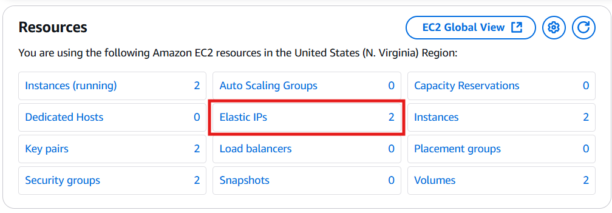

 - On the Elastic IP page, click 'Allocate Elastic IP address', leave everything default and click 'Allocate' at the bottom.


- With your new IP address, select it, then click Actions->Associate Elastic IP address.

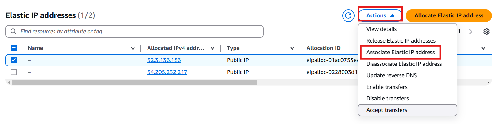

- On this page, select instance, then the instance you want to associate it with, and click to allow reassociation. This is incase you have an issue and need to reassign this IP without creating a new one. Repeat this process for both machines, each with there **OWN** IP address.


- Now you can connect to your machines. On the EC2 Dashboard, select instances. Then, one at a time, select an instance, click 'Connect'->Session Manager->Connect. If successful, a new tab will open connected to your machine.

- On both machines, run the following commands one after the other
``` shell
    $ sudo su
    $ sudo apt-get update
    $ sudo apt upgrade -y
    $ snap install kubectl --classic
    $ sudo apt install docker.io
```

- Now, on **ONE** of the machines we will setup Rancher. Go to [Rancher](https://www.rancher.com/quick-start) and copy the command listed there. Run this command on the one machine and wait for it to finish.


- When it is finished, run this command:
``` shell
    $ sudo docker ps
```
- This will give you the container-ID needed for setup

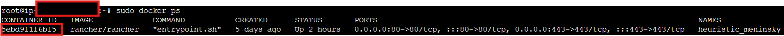

- Then, click on the public IPv4 DNS address to access the Rancher dashboard. 

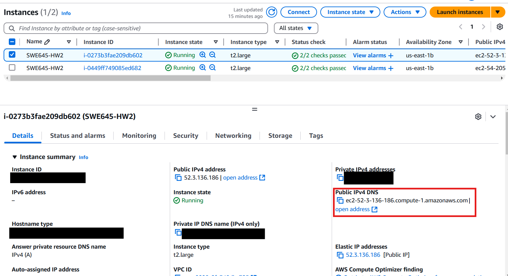

- It will give you a privacy warning, but it is okay. Click 'Show advanced' and click the proceed link there. Follow the directions on screen to setup your account with this container. You will use the following command:
```shell
    $ docker logs container-id 2>&1 | grep "Bootstrap Password:"
```
- Make sure to replace "container-id" with your container's id

- Paste this password given into the Rancher dashboard. You can now setup the admin account. You can either randomly generate a password or create your own, save this password. Then make sure to accept terms and conditions and click continue. You login for future use will be the following:

    - Username: admin
    - Password: "Your password you set"

- Once logged in, you will see the dashboard and any existing clusters. We will create a new one to run on our **OTHER** EC2 instance. 

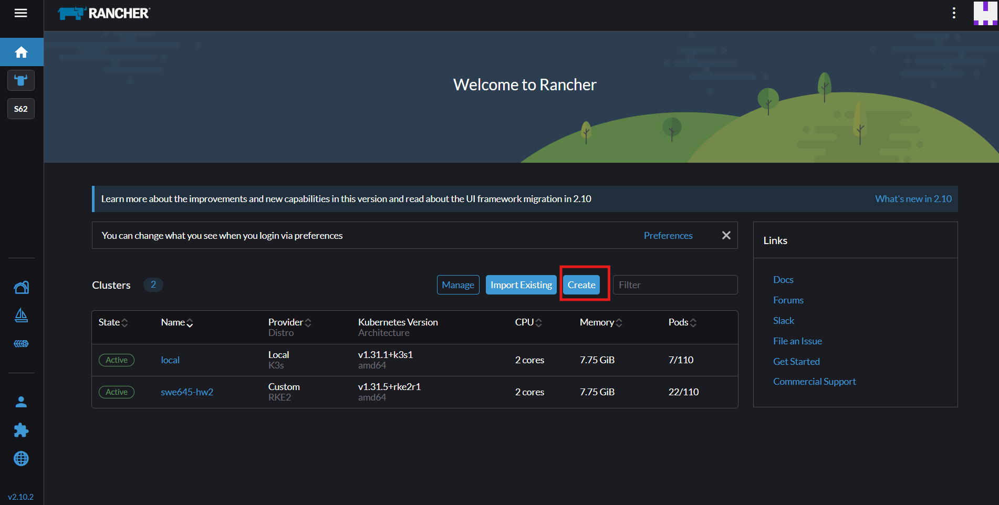

### 5. Create our cluter:

- Click on 'create' from the previous image

- In the next window, scroll and click on "Custom"


- Here, name your cluster, then click Create:


- Then, make sure etcd, Control Plane, and Worker are all checked. Then, click the insecure checkbox and copy the command given into your **SECOND** EC2 instance.


- Let that run and wait untill your cluster is ready. It will be ready when you see an active status like in ours below:

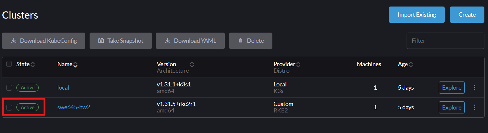

- Now, in order to use the 'kubeclt' command we installed earlier, we need to copy the KubeConfig to our machine running the cluster (second machine). To do this, click on your cluster, ours is swe645-hw2 in the previous picture. Click on the three dots in the top right and click then selected option in the picture below:

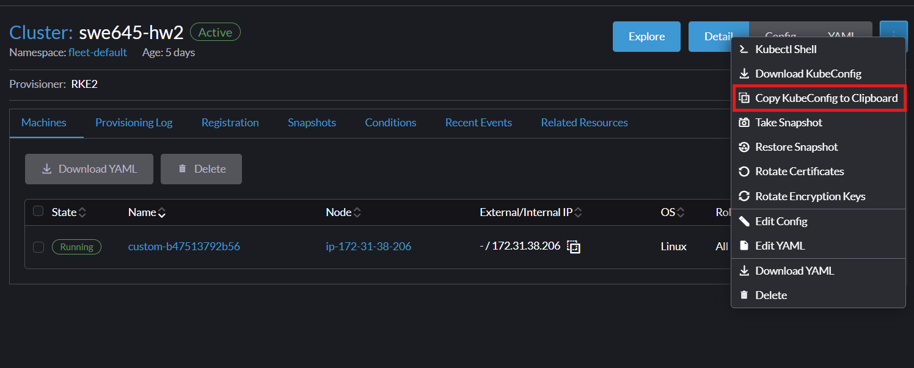

- Now past it in the following location. You with need to make the hidden directory '.kube'

```shell
    $ sudo mkdir .kube
    $ sudo vi .kube/config
```
- Paste and save in that file. Now with our cluster setup, we can deploy our application with a Deployment.

### 6.Deploy web application using Deployment:

- Back on the Racher Dashboard. Click home, then click your cluster to access your cluster dashboard like below:


- To create a Deployment, click Workloads->Deployments and click the create button.

- Fill in custom name, set replica count to 3, paste your Docker Image tag from part 1 in Container Image box. Then scroll and click 'Add Port or Service'. Select Node Port, name it, set Private Container Port to 8080. Leave everything else default. Click create and wait for pods to deploy, it will say active like our cluster before:

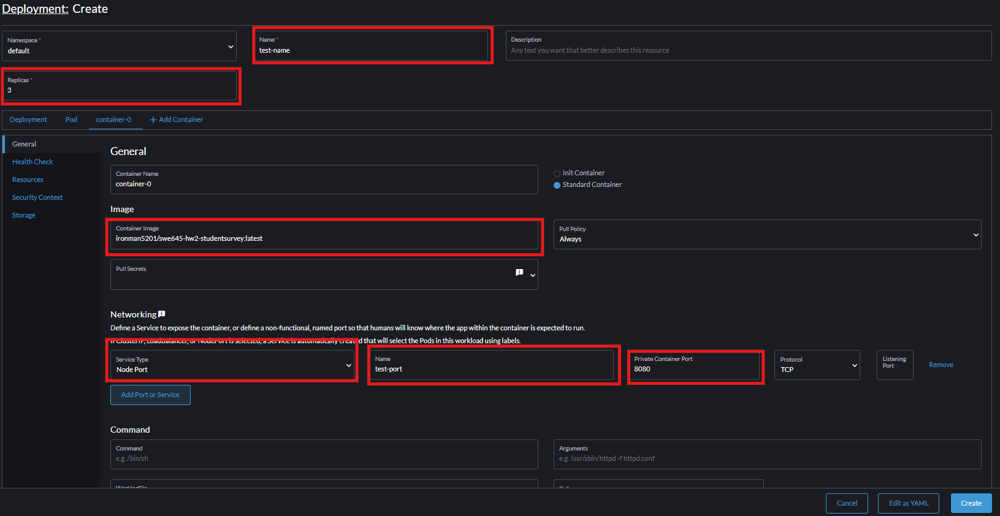

- Once you see it active state, click Service Discovery and take a look at the node port you created. Take note of the port number that was chosen randomly since we left that option blank. In out case the port number is 31221.


### 7. Add new security rule and access application

- In order to see our application, we need to add this port number as a new inbound rule to our security group just like we did for ports 80, 8080, 22, and 443. Go back to your AWS Dashboard on the EC2 instance page. Scroll down under Network & Security and click Security Groups.


- Here select the security group that your machines are using. Unless you customized the name it is typically some form of 'launch-wizard-#'. In our case, it is launch-wizard-1. Select the group, then click Actions->Edit inbound rules.


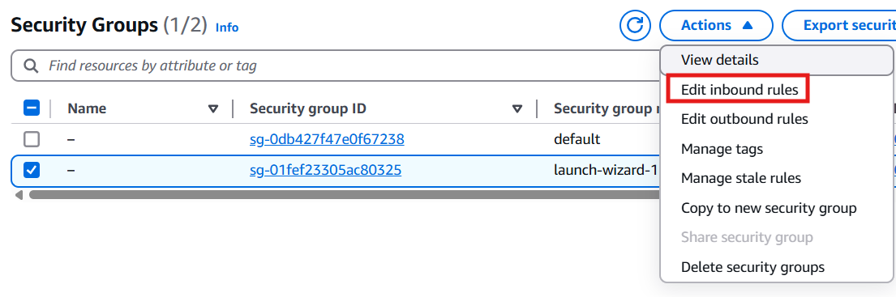


- Now, click 'Add rule' at the bottom and set a new rule similar to the one highlighted. Make sure to use the port number from **YOUR** NodePort service. Then for source select 'Anywhere-IPv4' to add the '0.0.0.0/0' option you see in the picture below. Click save rules.

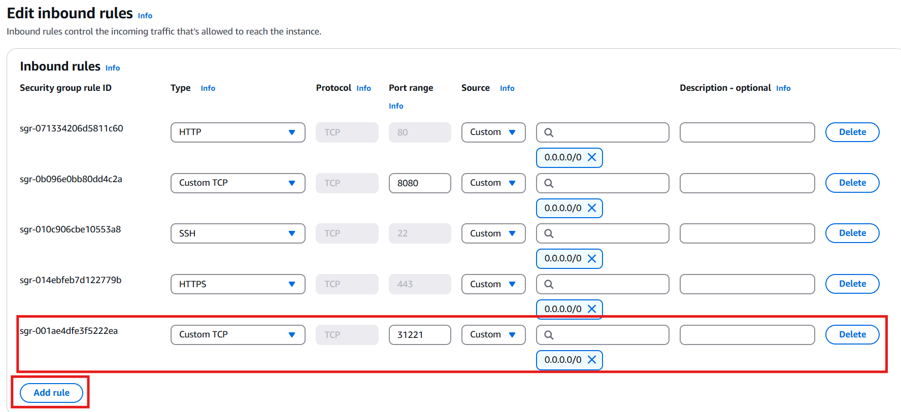


- With this rule added, we can now access our application using the NodePort service we created. Go back to your EC2 instances page. Select the **SECOND** machine, the one that has the actual cluster running on it. Click on the Public IPv4 DNS link to get this page. This is expected.

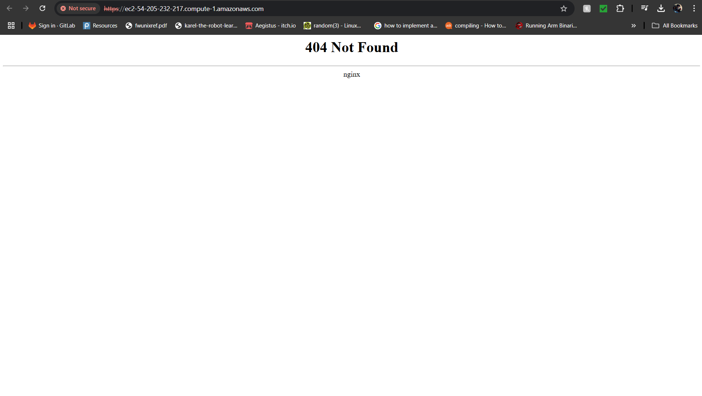

- To access our home page and survey page, we need to add specific parts to the end of this URL. You need to add ":"NodePort Number"/"war file name"/ to get the home page and add ":"NodePort Number"/"war file name"/"survey file name".html/ to get the survey file. In our case, we add "::31221/StudentSurvey/" and ":31221/StudentSurvey/survey.html" to the end of the URL. 

**NOTE: Make sure to change form https to http or the link won't work**

- Home page at [link](http://ec2-54-205-232-217.compute-1.amazonaws.com:31221/StudentSurvey/)

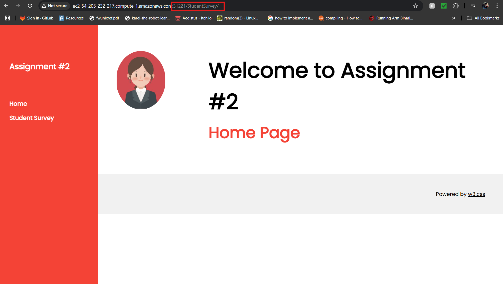

- Survey page at [link](http://ec2-54-205-232-217.compute-1.amazonaws.com:31221/StudentSurvey/survey.html)

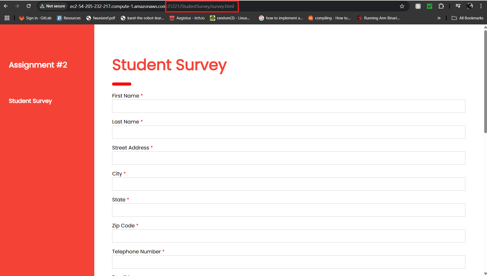

**NOTE: Links will only work in your machines are running. If you are using AWS Learner Lab. machines auto-shutoff after 4hrs.**