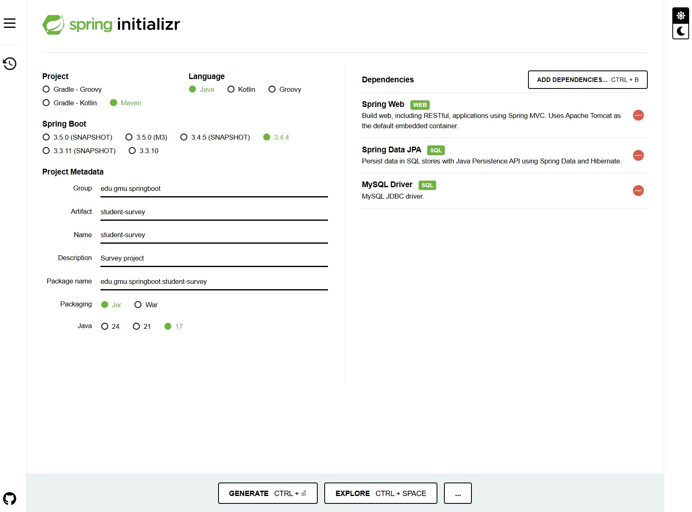
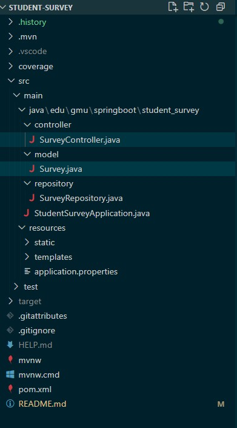
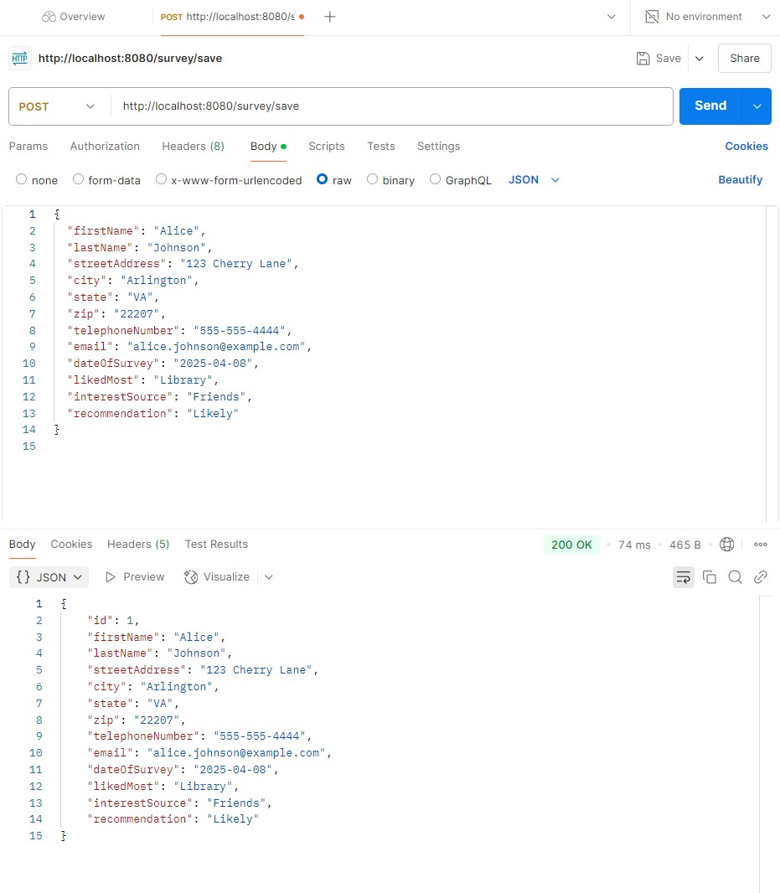
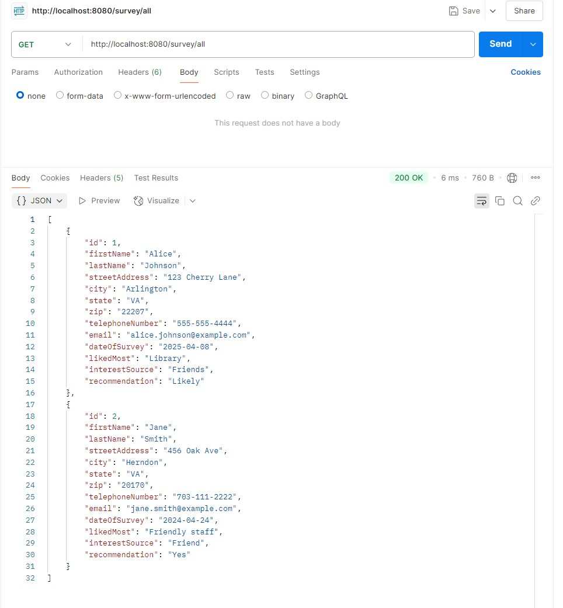
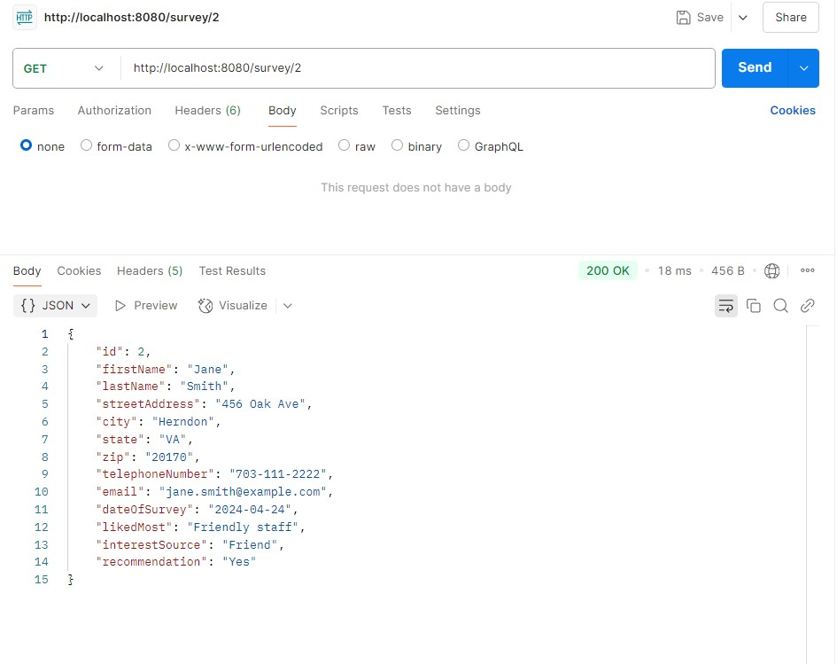
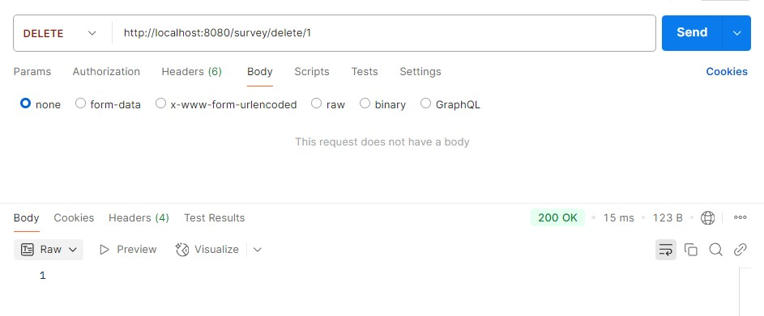
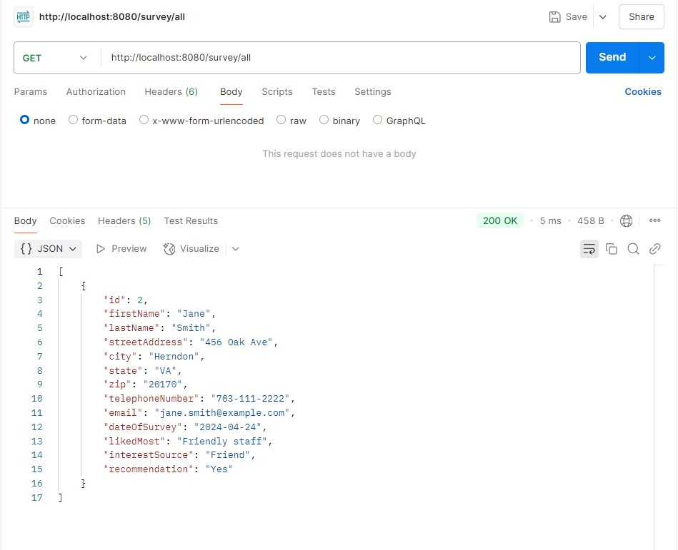
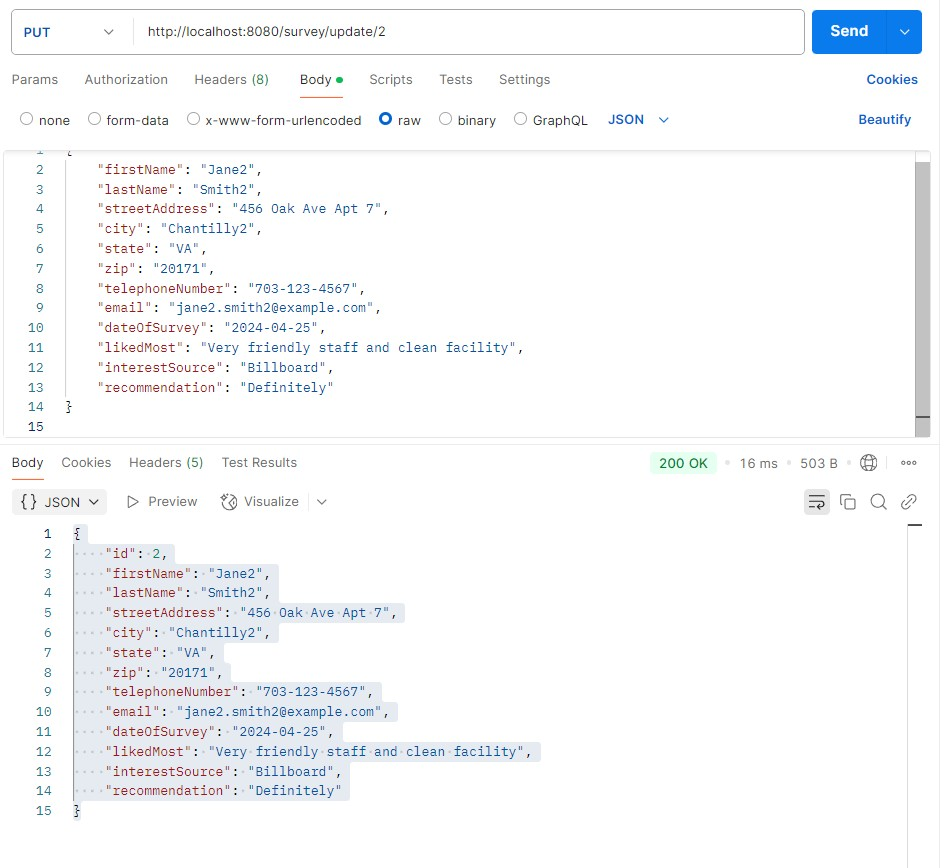

### **Student Survey Application**

This project is a Spring Boot application that collects survey data from users. It can be easily tested using Postman.

---

### **Prerequisites**

1. Java 17 or higher - Make sure Java is installed and configured.  
2. Maven - For building the Spring Boot project.  
3. Postman - For API testing.

---

### **Setup Instructions**

#### **1. Clone the Repository**

```bash
git clone https://github.com/Ranaalshehrii/swe645-hw3.git
cd swe645-hw3
```

#### **2. Configure Git (if not already set up)**

```bash
git config --global user.name "Your Name"
git config --global user.email "your.email@example.com"
```
### **Spring Initializr Setup**


---

### **Building and Running the Application Locally**

#### **1. Build the Project**

Make sure you are in the project root directory:

```bash
./mvnw clean install -DskipTests
```
OR
```bash
./mvnw clean package -DskipTests
```

- `clean`: Removes all previously compiled files.  
- `install`: Compiles, tests (if not skipped), packages, and copies the `.jar` file to your local repository.  
- `package`: Just creates the `.jar` file without installing it to the local repository.

---
---
### **Project Structure**

The folder structure of this application is shown below:


---

#### **2. Run the Spring Boot Application**

```bash
./mvnw spring-boot:run
```
OR if you want to run the `.jar` directly:
```bash
java -jar target/student-survey-0.0.1-SNAPSHOT.jar
```

---

#### **3. Access the Application**

- URL: `http://localhost:8080`

---

### **Step 6: Provide Connection Details**

Update `application.properties` with the following credentials:

**MySQL RDS Database Config:**

```properties
spring.datasource.url=jdbc:mysql://student-survey-db.cpo6pmgwxit1.us-east-1.rds.amazonaws.com:3306/student-survey-db?createDatabaseIfNotExist=true
spring.datasource.username=admin
spring.datasource.password=${DB_PASSWORD}
```

**Hibernate settings:**

```properties
spring.datasource.driver-class-name=com.mysql.cj.jdbc.Driver
spring.jpa.hibernate.ddl-auto=update
spring.jpa.show-sql=true
spring.jpa.database-platform=org.hibernate.dialect.MySQL8Dialect
```

> Note: RDS automatically creates the schema from the Spring Boot entity if `spring.jpa.hibernate.ddl-auto=update` is enabled.

---

### **Testing with Postman**

#### **1. Postman Setup**

- Base URL: `http://localhost:8080`

#### **2. API Endpoints**

| HTTP Method | Endpoint      | Description                       |
|-------------|---------------|-----------------------------------|
| POST        | /survey/save  | Save a new survey                 |
| GET         | /survey/all   | Get all survey responses          |
| GET         | /survey/{id}  | Get a specific survey by ID       |
| DELETE      | /delete/{id}  | Delete a specific survey by ID    |
| PUT         | /update/{id}  | Update a specific survey by ID    |

#### **3. Example POST Request**

- URL: `http://localhost:8080/survey/save`  
- Method: POST  
- Body: (JSON)


#### **4. Example GET Requests**

- Get All Surveys  
  - URL: `http://localhost:8080/survey/all`  
  - Method: GET

- Get Survey By ID  
  - URL: `http://localhost:8080/survey/1`  
  - Method: GET

#### **5. Example DELETE Request**

- Delete Survey By ID  
  - URL: `http://localhost:8080/delete/1`  
  - Method: DELETE


#### **6. Example PUT Request**

- Update Survey By ID  
  - URL: `http://localhost:8080/update/2`  
  - Method: PUT  
  - Body: (JSON)



---